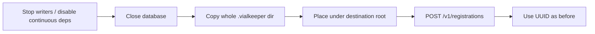
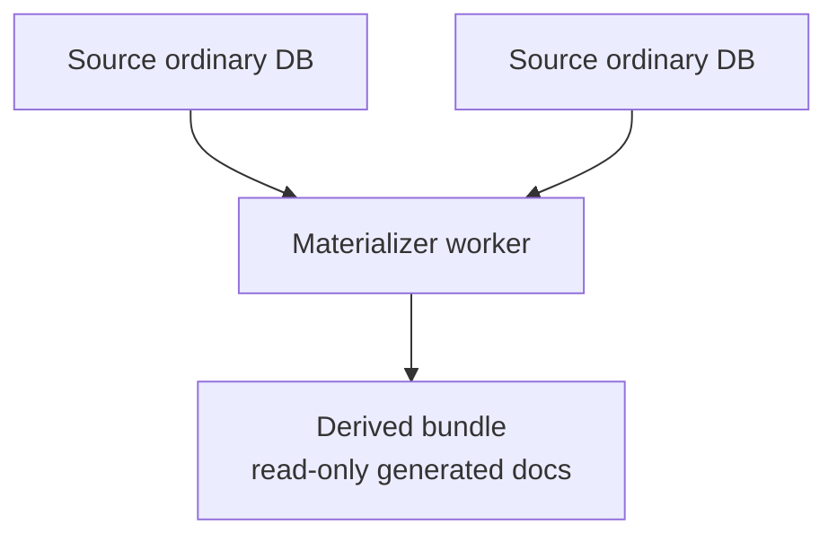

# VialKeeper operations

Runbook for deploying and running a Version 1 VialKeeper host. Applications
consume the host through the versioned HTTP `/v1` API; see [README.md](README.md)
for the client-facing route examples. Elixir modules are internal services, not
an application integration surface.

VialKeeper's product data model, structured query, subscriptions, views,
replication, federation, materialized views, and shadow read semantics are
**core**. Full-text search is a supported, rebuildable **sidecar**. Deployment,
configuration, lifecycle, security, maintenance, observability, shadow control,
and the required shipped console are **administration**. This runbook owns the
administration procedures; it does not define alternate core semantics.

Production and staging run an assembled OTP release. `mix` is for local
development and CI only.

```text
VIAL_KEEPER_ROOT/
  host.toml              # listener, auth, TLS, limits, federation, …
  registrations.json     # routing only (UUID → relative path)
  notes.vialkeeper/        # one bundle per logical database
    <backend data>       # backend-owned durable artifact
    blobs/
    tmp/
  notes.vialkeeper.lease   # transient exclusive ownership (not data)
  _derived/…             # optional derived DBs from materialized views
```

---

## Build the release

Pinned toolchain: Elixir 1.20.2 / OTP 29.0.4 (`mise.toml`). Rust stable
toolchain required (vendored `native/tantivy_ex` compiles a NIF at build time).

```sh
export MIX_ENV=prod
mix release.build
```

Output: `_build/prod/rel/vial_keeper/` (includes ERTS). Copy that tree to the
target host (same OS/ABI as the build machine).

```sh
/opt/vial_keeper/bin/vial_keeper eval \
  'IO.inspect(VialKeeper.Diagnostics.runtime(), pretty: true)'
```

`Diagnostics.runtime/0` reports Mix app version and runtime / selected-backend
identity from the BEAMs. This `eval` invocation is an operator-only release
diagnostic; it does not make the underlying Elixir module a supported client
API and it does not read git metadata.

---

## Start and stop

```sh
export VIAL_KEEPER_ROOT=/var/lib/vialkeeper

/opt/vial_keeper/bin/vial_keeper daemon   # background
# or: /opt/vial_keeper/bin/vial_keeper start
```

```sh
/opt/vial_keeper/bin/vial_keeper pid
/opt/vial_keeper/bin/vial_keeper remote   # remote console
/opt/vial_keeper/bin/vial_keeper stop
```

On first start in an empty root, VialKeeper creates the directory and a fully
commented `host.toml` from `priv/host.toml`. Existing `host.toml` is **never**
overwritten.

Default listener: **loopback only** `127.0.0.1:4000`. Binding a non-loopback
address requires `[auth] enabled = true` or `[tls] enabled = true`, unless
you set `[security] allow_insecure_remote = true` (risky).

Stop with `bin/vial_keeper stop` or SIGTERM. Open databases close; each runtime
releases its ownership lease.

### Development only

```sh
mix run --no-halt
```

Same supervision tree. Do not use Mix as the production entrypoint.

---

## `host.toml` map

All host config is one editable file under the database root. Edit, then
**restart**.

| Section | Purpose |
| ------- | ------- |
| `[listener]` | `ip`, `port` |
| `[limits]` | Host ceilings (bodies, batches, subscriptions, views, …) |
| `[admission]` | Fair scheduling weights / reserved slots per work class |
| `[federation]` | Cross-DB query bounds + `[[federation.saved_query]]` |
| `[web_ui]` | Embedded admin console on/off |
| `[auth]` | Bearer tokens (SHA-256 digests) |
| `[tls]` | HTTPS cert/key paths (relative to root) |
| `[security]` | `allow_insecure_remote` |
| `[observability]` | `otlp_endpoint` (empty = no exporter, no network) |

Template with defaults: `priv/host.toml`.

---

## Authentication

When `[auth] enabled = true`:

- Every `/v1` request needs `Authorization: Bearer <token>`.
- Every `/ui/fragments/…` and `/ui/actions/…` request needs the same header.
- `/ui` shell and `/ui/assets/…` stay anonymous so the browser can collect a
  token. They expose no database state.

Generate a token:

```sh
/opt/vial_keeper/bin/vial_keeper token
# token:  <64-char hex>   ← clients send this
# digest: <64-char hex>   ← paste into host.toml
```

```toml
[auth]
enabled = true
tokens  = ["<digest>"]
```

Restart. Clients send the **raw** token, never the digest.

```sh
curl -H "Authorization: Bearer <token>" http://127.0.0.1:4000/v1/databases
```

Rotate with zero downtime: add the new digest, restart, remove the old digest,
restart. There is no runtime revocation API. Failures always return
`unauthorized` (HTTP 401) with the same message.

Remote replication to an auth-enabled target: put the raw token in the job
endpoint as `auth_token`. The replication wire requires `Accept-Encoding: zstd`.
JSON bodies use `Content-Encoding: zstd` and `x-vialkeeper-uncompressed-length`.
Generic HTTP compression is disabled on the listener so public `/v1` JSON is
never auto-compressed.

---

## TLS

When `[tls] enabled = true`, the listener serves **HTTPS only** (no parallel
plaintext port). Paths are relative to the database root:

```toml
[tls]
enabled  = true
certfile = "cert.pem"
keyfile  = "key.pem"
```

Self-signed for local tests:

```sh
openssl req -x509 -newkey rsa:2048 -nodes -days 365 \
  -keyout "$VIAL_KEEPER_ROOT/key.pem" -out "$VIAL_KEEPER_ROOT/cert.pem" \
  -subj "/CN=localhost"
```

Use a real CA in production. Replication uses TLS when `base_url` is `https://…`.

---

## Database root and registration

Clients never send absolute filesystem paths. Create/register take **relative**
paths that must not escape the root (`..`, symlinks).

```text
notes.vialkeeper/
├── <backend data>     # metadata, revisions, indexes, views, jobs, …
├── blobs/             # attachment representations (<prefix>/<digest>.blob)
└── tmp/               # incomplete uploads and Tantivy search generations (not authoritative)
```

`registrations.json` is routing only:

```json
{
  "version": 1,
  "databases": [
    {"uuid": "…", "path": "notes.vialkeeper", "database_kind": "ordinary"}
  ]
}
```

`database_kind` is a reconstructible hint. Backend metadata inside the bundle
wins on open. Unregistered bundles under the root stay inert — VialKeeper does
**not** auto-adopt them.

| Action | How |
| ------ | --- |
| Create | `POST /v1/databases` `{"path":"notes.vialkeeper"}` |
| Register existing | `POST /v1/registrations` `{"path":"…"}` |
| List / info | `GET /v1/databases`, `GET /v1/databases/:uuid` |
| Close | `POST /v1/databases/:uuid/close` |
| Unregister | `DELETE /v1/registrations/:uuid` (bundle files kept) |

Public identity is the UUID, never the path. Duplicate UUID →
`duplicate_database_uuid`. Missing file after registration →
`database_unavailable` (manifest entry is not silently dropped).

---

## Offline copy, move, and restore



1. Stop writes. Disable continuous replication that needs the DB open.
   If this DB is a source for an **enabled** materialized view, disable that
   materialization first. If it is itself derived, disable its materializer
   first.
2. `POST /v1/databases/:uuid/close`. Live subscriptions end with `closed`.
   Confirm no attachment upload/download/GC is still running.
3. Copy the complete closed `.vialkeeper` directory with ordinary OS tools.
4. Ignore `.lease` — it is transient ownership, not data.
5. At the destination: place the bundle, then register the relative path.
6. Traffic addresses the same UUID (document routes auto-open, or open via
   catalog).

A copy keeps the original UUID. Two copies of the same UUID on one host are
rejected. Copying is backup/relocation, **not** cloning.

Do not copy an active crash-recoverable bundle piecemeal: keep every
backend-owned recovery artifact with the durable data until recovery finishes.
SQLite-specific journal pairing is documented in
[lib/vial_keeper/storage/sqlite/BACKEND.md](lib/vial_keeper/storage/sqlite/BACKEND.md).

Derived bundles are often created as
`_derived/<slug>--<short-uuid>.derived.vialkeeper`. Path and suffix are
operator hints; `database_kind = derived` is authoritative. A clean derived
bundle can be moved/renamed and re-registered; materialization state stays
inside the bundle.

---

## Admin console (`/ui`)

When `[web_ui] enabled = true` (default):

```text
http://127.0.0.1:4000/ui
```

Server-rendered HTMX. Assets are compiled into the release (no CDN, no
runtime frontend directory). With auth enabled, enter the raw bearer token in
the console; it stays in browser `sessionStorage` and is sent as
`Authorization: Bearer` on state-bearing requests. No server UI session /
cookie. Logout or closing the tab clears the token.

The console calls the same project-owned application services as `/v1`; it is
not a second data API. Status pages use bounded HTMX polling (no second
WebSocket stack).

---

## Lease recovery (`database_in_use`)

Each open database holds exclusive ownership through the selected storage
backend. A second owner fails immediately with `database_in_use` (HTTP 409,
retryable).

Safe recovery:

1. Confirm no live VialKeeper process owns the DB (`bin/vial_keeper pid`, process
   list). A healthy owner always holds the lease while open.
2. After a crash, a leftover `.lease` **file** with no live exclusive lock
   can be reopened normally. Do **not** delete `.lease` while another process
   may still hold the lock.
3. Prefer letting the crashed BEAM die, then retry open. Only remove a stale
   `.lease` file when you are sure nothing has the database open.
4. Never delete or rewrite backend data artifacts to “clear” a lease.

SQLite implements ownership with an exclusive sidecar lease; see
[BACKEND.md](lib/vial_keeper/storage/sqlite/BACKEND.md).

---

## Integrity and compaction

```sh
curl -X POST http://127.0.0.1:4000/v1/databases/$UUID/integrity-check \
  -H 'content-type: application/json' -d '{}'
```

Checks logical integrity (revision ancestry, attachment manifests vs physical
blobs, winners, changes references, index consistency) plus any backend
physical probes. Failures → `integrity_violation`. Rebuild a bad logical
index with the index rebuild endpoint after you inspect details.

Unreferenced physical blobs are reclaimable orphans, not proof that a
committed revision is missing bytes.

```sh
curl -X POST http://127.0.0.1:4000/v1/databases/$UUID/compact \
  -H 'content-type: application/json' -d '{}'
```

Runs compact-retention for the database (subject to its `retention` config).
May schedule attachment GC afterward. Attachment GC is also available from
the Web UI maintenance actions (not a separate public `/v1` GC route).

Per-database retention defaults (`GET`/`PUT …/config`):

```json
"retention": {
  "mode": "disabled",
  "history_depth": 0,
  "peer_expiry_ms": 86400000,
  "schedule": "disabled"
}
```

`mode` is `disabled` or `stable_frontier`. Host ceilings still bound values.

---

## Attachments (ops)

Uploads: `POST …/attachments/upload` with `application/octet-stream`.
Downloads: `POST …/attachments/get` with `{id, revision?, name}`.

On disk every blob is one file, `blobs/<2-hex-prefix>/<digest>.blob`: the
stored payload (raw bytes or a Zstandard frame, chosen once at ingest by a
compressibility probe) followed by a fixed 92-byte trailer carrying the
format version, encoding, logical/payload lengths, logical digest, and
payload checksum. Downloads always return the original logical bytes;
`integrity_check` validates both the payload checksum and the decoded
logical digest. Do not edit or truncate these files — a payload or trailer
mismatch makes the blob unreadable and replication of it fails cleanly.

Database config keys (host-bounded):

- `attachments.max_attachment_bytes`
- `attachments.max_concurrent_attachment_reads`
- `attachments.max_concurrent_attachment_writes`

Admission is separate from database-owner admission. Overrun → retryable
`attachment_overloaded`. Oversized upload → `payload_too_large` (no revision
reference). Changing limits does not rewrite stored blobs.

Batch uploads stream independent blobs with bounded concurrency. The product
default is 16 writers, capped by that database's
`attachments.max_concurrent_attachment_writes` (ordinary database default 4).
Raise the database write limit when a host should allow the batch default.

A blob is live if a retained revision manifest references it or an unexpired
pending upload protects it. After compact removes a manifest, GC deletes
orphan files under an exclusive coordinator barrier. Crash during GC can leave
orphans — rerun GC after recovery.

---

## Admission and fairness

Each open disk database has a bounded snapshot read pool beside the single
writer. Classified reads use up to `read_pool_size` readonly connections
(FIFO, extra waits capped by `read_queue_limit`). Writes and exclusive work
still go through one `DatabaseAdmission` permit onto `DatabaseOwner`. Exclusive
commands (compact, integrity, rebuild, live-digest, blob cleanup, close) drain
in-flight snapshots first.

| Class | Typical work |
| ----- | ------------ |
| `foreground` | Client document / query / changes / admin |
| `subscription` | Live-query snapshots and shared changes reads |
| `replication` | Local revision / checkpoint work for jobs |
| `maintenance` | Compact-retention and background maintenance |

`[admission]` sets positive service weights and reserved queue slots for
**writer** work. Scheduling is deterministic weighted round-robin (FIFO inside
a class). Total active+queued writer work is capped by `[limits] admission_limit`.

Slow attachment streams, network blob transfers, long waits, and heartbeats
do **not** hold an owner permit after their short metadata step.
`database_overloaded` means admission capacity for that class/request is full
(retryable).

---

## Replication jobs

Persistent jobs live in the owning database bundle. Workers are transient.

```sh
# Inspect / control under:
# /v1/databases/:uuid/replications
```

Job create body (shape):

```json
{
  "mode": "continuous",
  "direction": "push",
  "enabled": true,
  "endpoint": {
    "kind": "remote",
    "database_uuid": "…",
    "base_url": "https://peer:4000",
    "auth_token": "raw-token-if-needed"
  }
}
```

Local endpoint: `{"kind":"local","database_uuid":"…"}`.

| State | Meaning |
| ----- | ------- |
| `idle` | Registered / waiting |
| `handshake` / `install_boundaries` | Compatibility + retention boundaries |
| `bootstrap` | Snapshot when incremental history is unavailable |
| `read_changes` / `diff` | Bound work and missing revisions |
| `transfer` | Concurrent chain/blob fetch before import |
| `import` | One atomic target import after bytes are durable |
| `checkpoint_target` / `checkpoint_source` | Durable checkpoints in order |
| `report_peer` | Safe-position / peer report |
| `waiting` | Continuous job caught up |
| `backoff` | Retryable failure; jittered retry |
| `completed` | One-shot finished |
| `failed` | Non-retryable or cancelled |

Per-DB replication knobs (host-bounded):
`max_concurrent_chain_fetches`, `max_concurrent_blob_transfers`,
`max_transfer_bytes_in_flight`. Byte budget uses original attachment lengths
for admission only; it does not change blob identity or compression.

Enabled continuous jobs resume after catalog startup. Cancellation is
cooperative: transfer tasks stop; an already committing import/checkpoint is
allowed to finish.

Remote wire behavior: every non-empty JSON request/response between peers is
one bounded Zstandard frame (`Content-Encoding: zstd` plus
`x-vialkeeper-uncompressed-length`); attachment payloads transfer as the stored
`.blob` representation byte-for-byte
(`application/vnd.vialkeeper.blob-representation`, no HTTP `Content-Encoding`),
so the target never re-encodes. Troubleshooting: a peer that answers with
plain uncompressed JSON on wire routes is not an VialKeeper replication
endpoint (or an intermediary rewrote the response) — the job fails with
`replication_incompatible`; malformed frames, wrong declared lengths, and
over-limit bodies are rejected deterministically with `invalid_request` /
`payload_too_large` and never advance checkpoints; plain 5xx pages from load
balancers stay retryable.

What replicates vs what stays local: see [README.md](README.md#replication-application-view).

---

## Shadow control and workers

Shadow control is disabled by default. A source host can manage a
generation-fenced read-only shadow through its source-side
`/v1/databases/:uuid/shadow` route when `[shadow_controller].enabled = true`.
The request is asynchronous: `PUT` persists desired state first, then
removes any superseded route and queues local reconciliation, while `GET`
returns redacted desired/observed state. Disable persists the fenced
disabled definition before the matching route is removed. Source close
drops only the local route and does not wait for the worker; unregister
also converts desired state to disabled cleanup. After a host restart the
in-memory route table starts empty and reconcilers resume from durable
desired state when the controller is enabled. The source route accepts only
ordinary source databases and does not expose tokens or managed filesystem
paths.

The worker side is configured independently:

```toml
[shadow_worker]
enabled = true
storage_root = "shadows"                 # relative to the database root
control_token_digests = ["<sha256-digest>"]
allowed_attachment_roots = ["/srv/vialkeeper/cas"]
allowed_source_origins = ["https://source.example"]
```

`control_token_digests` authenticates only `/v1/control-plane/...`; it is
intentionally separate from `[auth].tokens`. The control plane accepts and
returns bounded Zstandard JSON frames, and its routes are not part of the
ordinary public shadow API. Managed bundles are derived from the exact source
UUID, shadow UUID, and generation; the worker keeps a journal and validates
that the bundle path remains beneath `storage_root` before inspect or destroy.

For a remote worker, add a named `[[shadow_controller.location]]` with
`kind = "remote"`, `control_base_url`, `control_bearer_token`,
`control_timeout_ms`, and `read_timeout_ms`. Local locations omit remote
fields. The source's `source_base_url` and `source_bearer_token` are used for
source-side worker operations and must be kept as secrets. Attachment roots
are existing external CAS directories; VialKeeper does not copy them into the
shadow bundle.

The worker lifecycle is `bootstrapping` until a later replication proof marks
the exact generation ready. A failed or incompatible control request leaves
the source route unready and never makes a partially provisioned generation
public.

### Shadow read routing

Public document and attachment reads default to `eventual` when a ready shadow
route exists. Send `x-vialkeeper-read-consistency: primary` to bypass the shadow
explicitly; `eventual` may also be sent explicitly. The source keeps an exact
in-memory route snapshot containing the source/shadow UUIDs, generation, operation ID,
and endpoint; a route is never selected by UUID alone. Shadow point and bulk
read responses include `x-vialkeeper-read-served-by: shadow` and the durable
`x-vialkeeper-source-watermark`. Source-served responses, including fallback and
explicit `primary` consistency, identify `source` and omit the watermark.

A lagging document, revision, or attachment miss falls back the request (the
whole original batch for bulk-get) and keeps the ready route. Transport,
protocol, identity, or store failure falls back once, removes only the
matching generation snapshot, and asks the reconciler to re-inspect. Routing
stays off while the source is closed or unregistered. Attachment reads use
the external CAS as a
read-only physical representation stream; the worker never writes or copies
those bytes into the managed shadow bundle.

---

## Live subscriptions (ops)

`POST /v1/databases/:uuid/query/stream` (NDJSON). Host ceilings:

- `max_query_subscriptions`
- `max_query_subscription_members`
- `max_query_subscription_buffered_events`
- `max_query_subscription_heartbeat_ms`

Slow clients that exhaust delivery credit get `subscription_overloaded`;
other subscriptions continue. Subscription runtime state is not durable and
is not restored after reopen. Database close terminates streams with
`closed`.

---

## Local views, federation, materialized views

### Local views

Definitions and materialization live in the owning database bundle and do
not protocol-replicate. Host ceilings: `max_views_per_database`,
`max_view_batch_changes`, `max_view_consistent_wait_ms`.

### Federation

Ad-hoc: `POST /v1/federation/query`. Bounds in `[federation]`:
`max_sources`, `max_concurrent_sources`, `max_candidates`, `max_execution_ms`.

Saved queries (no derived DB) live only in `host.toml`:

```toml
[[federation.saved_query]]
name = "open-tasks"
sources = ["123e4567-e89b-12d3-a456-426614174000"]
query_json = '{"selector":{"/state":"open"},"sort":[{"path":"/value","direction":"asc"}],"limit":50}'
```

Edit file → restart. List/execute over HTTP. Bookmarks are not allowed inside
saved definitions.

Federation is strict: one bad source fails the whole request. No atomic
cross-DB snapshot.

### Materialized federated views

Lifecycle: `POST/GET /v1/materialized-views`, plus
`/:uuid/{refresh,rebuild,enable,disable}`.



- External put/delete/bulk/resolve, attachment mutation, and replication
  **import** on the derived DB → `derived_database_read_only`.
- Derived DBs remain readable / queryable / indexable; they may be a
  replication **source**.
- If a source is down, last committed derived result stays readable; status
  reports stale / source-unavailable.
- Disable materializers before closing sources or the derived DB.
- While `rebuilding`, do not treat status as `current`.

Host ceilings: `max_materialized_view_sources`,
`max_materialized_view_concurrent_sources`,
`max_materialized_view_batch_documents`,
`max_materialized_view_retry_delay_ms`.

---

## Host limits and troubleshooting

Important `[limits]` keys (see `priv/host.toml` for defaults):

- `admission_limit` — active + queued owner ops per open DB
- `read_pool_size` — concurrent snapshot readers per open disk DB (`1..32`, default `4`)
- `read_queue_limit` — queued classified reads waiting for a reader (`1..4096`, default `128`)
- `max_open_databases`, `max_replication_workers`
- Replication chain-fetch / blob-transfer / batch / in-flight-byte ceilings
- Live-subscription and local-view ceilings
- Materialized-view ceilings
- `max_request_bytes`, `max_document_bytes`, `max_document_id_bytes`
- `max_bulk_operations`, `max_changes_batch`, `max_query_results`
- `max_query_execution_ms` — ceiling for one query (default `5000`)
- `max_search_rebuild_ms` — ceiling for one full-text index rebuild on `create_index` / `rebuild_index` (default `300000`, five minutes). Raise this for large corpora; it is independent of the query budget. Restart after editing `host.toml`.
- `max_search_rebuild_batch_documents` — maximum winning documents submitted to Tantivy in one rebuild batch (default `500`). Lower this to reduce per-call memory and latency; raise it only when the writer budget allows it.
- `max_search_writer_memory_bytes` — Tantivy writer memory budget (default `50000000`, with Tantivy's 15 MB minimum). This bounds the native indexing writer; it is independent of the rebuild timeout.
- `max_search_candidates` — maximum full-text candidates retained before selector, predicate, or sort post-filtering (default `10000`). Queries that exceed this bound fail with `resource_limit` instead of silently truncating results.
- `max_json_nesting_depth`
- Attachment size and concurrency ceilings

Federation bounds are under `[federation]` (host-level: no single source DB
owns an ad-hoc federated request).

| Code | Typical cause |
| ---- | ------------- |
| `invalid_request` | Unknown JSON fields, bad shape |
| `unauthorized` | Missing / wrong bearer token |
| `database_in_use` | Lease held / second owner |
| `database_not_closable` | Active work / continuous dependency |
| `database_overloaded` | Owner admission or snapshot read-pool queue is full |
| `subscription_overloaded` | Live subscription / buffer saturated |
| `attachment_overloaded` | Attachment read/write/GC saturated |
| `view_not_found` / `view_name_conflict` | Local view lifecycle |
| `view_not_caught_up` | Consistent view wait expired |
| `derived_database_read_only` | Mutation/import on derived DB |
| `database_unavailable` / `database_closed` | Missing bundle / closed runtime |
| `duplicate_database_uuid` | Two registrations for one UUID |
| `revision_conflict` / `checkpoint_conflict` | CAS / leaf races |
| `bookmark_stale` | Continue after source/plan change |
| `resource_limit` / `payload_too_large` | Size / count caps |
| `integrity_violation` | Integrity check or corrupt revision |
| `replication_already_running` | Worker exclusivity on same job id |
| `history_truncated` | Changes cursor behind retention floor |

Backend exception names and engine query text are not public. Use the envelope:
`code`, `message`, `retryable`, `details`.

---

## Observability

OTLP is **opt-in**. Empty `otlp_endpoint` means no exporter and no collector
network connection.

```toml
[observability]
otlp_endpoint = "http://localhost:4318"
```

Restart the release. Protocol: OTLP HTTP protobuf. Spans batch
asynchronously; metrics export about every 30 seconds. Instrumentation does
not block the hot path.

### Span / metric catalog (stable names)

| Event | Span | Metric |
| ----- | ---- | ------ |
| Database open | `vial_keeper.database.open` | `….open.count` |
| Database command | `vial_keeper.database.command` | `….command.duration` |
| Admission overload | — | `vial_keeper.database.overload.count` |
| Admission wait | — | `vial_keeper.database.admission.wait` |
| Read pool occupancy / wait / exclusive drain | — | `vial_keeper.database.read_pool.active`, `….queued`, `….wait`, `….quiesce.duration` |
| Changes read | `vial_keeper.changes.read` | `….duration` |
| Query execute | `vial_keeper.query.execute` | `….duration` |
| Index build | `vial_keeper.index.build` | `….duration` |
| Search cache rebuild | `vial_keeper.search.rebuild` | `….count` + `….duration` |
| Search rebuild batch / refresh / query | `vial_keeper.search.rebuild.batch`, `….refresh`, `….query` | matching count + duration |
| Replication batch / transfer / checkpoint | matching `vial_keeper.replication.*` | matching |
| Replication remote wire | — | `vial_keeper.replication.wire.bytes` + `….wire.codec.duration` |
| Subscription update / open / overload | `….subscription.update` | matching counters |
| View update / query | `vial_keeper.view.*` | matching |
| Federation query | `vial_keeper.federation.query` | `….duration` |
| Derived view batch | `vial_keeper.derived_view.batch` | `….duration` |
| HTTP request | `vial_keeper.http.request` | `….duration` |
| Shadow read / route fallback | `vial_keeper.shadow.*` | count + duration |
| Attachment read / write / GC | `vial_keeper.attachment.*` | count + duration |

`error.code` uses stable atoms from `VialKeeper.Error` (e.g.
`revision_conflict`). Expected domain errors leave span status UNSET; only
`internal_error` (and unknown adapter failures) mark ERROR.

### Attribute allow-list

Owned by `VialKeeper.Observability.Attributes`. Includes `db.uuid` (never the
filesystem path), `command.type`, `error.code`, `outcome`, HTTP method/route
template/status, index/replication/admission/subscription/view/federation
ids and bounded counts, plus `trigger` (compact and search-rebuild), plus the bounded remote-wire dimensions (`direction`,
`payload_kind`, `endpoint_kind`, `encoding`, `operation`). **Never** recorded:
document bodies, document IDs, attachment names/digests/bytes, search text,
revision bodies, full remote URLs, tokens, or raw codec error text.

### Trace context

- Inbound HTTP: W3C `traceparent` / `tracestate` extracted.
- Outbound replication: current context injected so push jobs share one
  `trace_id` across hosts.
- Finch client telemetry is bridged to OTel. Bandit server is **not** bridged
  (would double-span with `vial_keeper.http.request`).

### Optional local observability snapshot

`GET /v1/observability/snapshot` exists only when application env
`:observability_dashboard` is `true`. That flag is **not** a `host.toml` key;
OTLP collection is configured via `otlp_endpoint` only.

---

## Quick checklist

```text
[ ] Build release on matching OS/ABI
[ ] Set VIAL_KEEPER_ROOT; first start creates host.toml
[ ] Bind non-loopback only with auth and/or TLS
[ ] Paste token digests into [auth]; clients use raw tokens
[ ] Put TLS cert/key under the database root when enabled
[ ] Register bundles explicitly; do not rely on auto-scan
[ ] Close before offline copy; copy whole .vialkeeper; skip .lease
[ ] Disable materialized views before closing their sources
[ ] Point otlp_endpoint only if a collector is ready
[ ] Prefer Diagnostics.runtime/0 + integrity-check for support dumps
```

## Dataset-backed benchmarks

TREC-COVID FTS, Simple Wikipedia stress, PMC, and Open Images torture are opt-in Mix commands.
They are not part of the release or the ExUnit gate. All source objects,
generated manifests, work databases, caches, and reports stay under a
mandatory external root. The standard location is
`/mnt/other/downloads/vialkeeper/`. The repository, `/tmp`, `$HOME`, and the
current working directory are rejected.

First-use workflow:

```sh
mix bench.data configure --root /mnt/other/downloads/vialkeeper
mix bench.data status
mix bench.data prepare trec-covid
mix bench.fts
```

`status` prints free space and each dataset's expected source size, local
size, and estimated VialKeeper working space (source plus a second copy
inside bundles, plus a 10 GiB / 15% reserve). The default `standard` profiles
are sized to expose ingest, FTS rebuild, and attachment bottlenecks without
running the hour-scale corpora (20,000 TREC docs, 20,000 Simple Wikipedia
articles, 400 Open Images JPEGs). Use `--profile smoke` for a tiny subset of
the same code path. Re-run `mix bench.data prepare` after a scale change;
a READY fixture whose recorded `selection_count` is stale is replaced.

Torture, stress, FTS, and dataset prepare print phase progress (10% steps plus
a 30-second heartbeat). `--stall-timeout-ms` (default 300000) aborts a
countable phase that stops completing work, with a diagnostic dump.

Prepare and the runners do not accept `--root`. Cleanup is one named dataset
at a time (`mix bench.data clean trec-covid`). Details, Git vs external
files, and the other two suites: [bench/README.md](bench/README.md).

## Replacing the storage backend

Product semantics live in shared services and storage ports. A backend
replacement should touch only:

- `lib/vial_keeper/storage/ports/` contracts and the new backend tree
- backend-owned bundle artifact / ownership / capability code
- physical tests under `test/physical/<backend>/`

Do not reimplement mutation, replication, retention, query, view, or derived
materialization algorithms inside the backend. For the current SQLite
implementation notes, see
[lib/vial_keeper/storage/sqlite/BACKEND.md](lib/vial_keeper/storage/sqlite/BACKEND.md).
