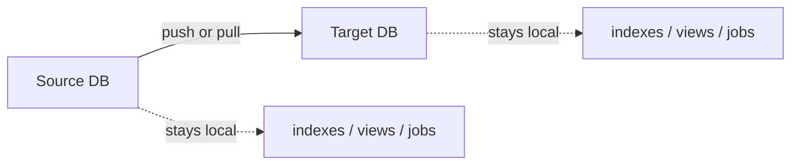
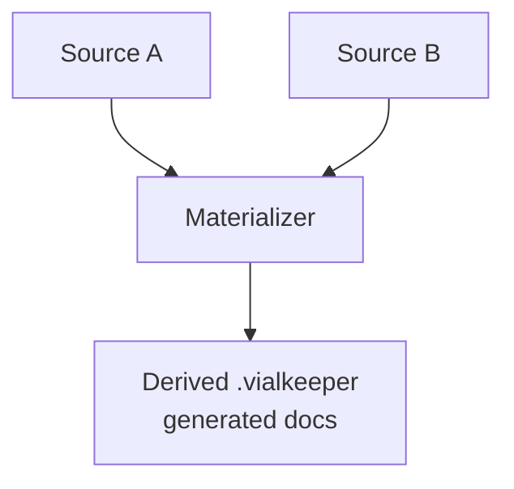

# VialKeeper

VialKeeper is a revisioned JSON document database that runs as one Elixir OTP
application. Each database is a portable `.vialkeeper` bundle on disk. Clients
talk JSON over the versioned HTTP `/v1` API. Clients submit structured requests
rather than backend engine commands. Elixir modules are internal implementation
boundaries, not a supported embedding API.

> **Authoritative specification:** The maintained wiki is in UnboundMark folder `4007e0d9-3cf2-4f17-a694-5680200d6547` starting at *VialKeeper Wiki Home* (`doc-id:898c633d-1b46-472b-b0b8-1080034313de`), with the requirement ownership map at `doc-id:1219e090-a3c6-4df1-9cba-4f36cf1b693d`. The superseded monolith (`doc-id:36d4783d-b2b4-4b37-8d61-5ef189368861`) is historical and stored in UnboundMark folder `9ec9f3fc-5394-4685-bfa4-0bcd8a698c47`. This README is an application overview and does not duplicate normative contracts; see the wiki for normative behavior, proof, and release acceptance. The operator runbook is `Operations.md`.

### Specification wiki

| Topic | Authoritative UnboundMark document |
| ----- | ---------------------------------- |
| Navigation and maintenance rules | *VialKeeper Wiki Home* (`doc-id:898c633d-1b46-472b-b0b8-1080034313de`) |
| Product tiers and capability boundaries | *VialKeeper Product Capability Boundaries* (`doc-id:ace5219f-cce9-4298-afff-56fd34f9b19d`) |
| Terminology and conventions | *VialKeeper Terminology & Conventions* (`doc-id:647b9d70-df56-441d-9840-05356e0968ff`) |
| Requirement ownership | *VialKeeper Requirement Ownership Map* (`doc-id:1219e090-a3c6-4df1-9cba-4f36cf1b693d`) |
| Architecture, configuration, and lifecycle | *VialKeeper System Architecture & Lifecycle* (`doc-id:ac5c396e-db37-495e-91e3-b5878f6b68ce`) |
| Bundle, storage, and durability | *VialKeeper Bundle, Storage & Durability* (`doc-id:460e8754-4a57-44a4-a3b7-0d6a0e25163b`) |
| Documents, revisions, and changes | *VialKeeper Documents, Revisions & Changes* (`doc-id:bf7cd39e-5d5a-4fc1-841c-06e5dcb24f80`) |
| Attachments | *VialKeeper Attachments* (`doc-id:d6ccab8d-df51-4efc-9ed8-282bbc1c052c`) |
| Queries, indexes, search, and subscriptions | *VialKeeper Queries, Indexes, Search & Subscriptions* (`doc-id:16575fb8-be14-49ba-96f5-624e00f489f9`) |
| Replication | *VialKeeper Replication* (`doc-id:2086b2a5-205c-47eb-bb36-708ec137cba8`) |
| Views, federation, materialized views, and shadows | *VialKeeper Views, Federation & Shadows* (`doc-id:ecc8d616-c16f-46cb-92dd-31ec445c3ac6`) |
| HTTP API and security | *VialKeeper HTTP API & Security* (`doc-id:fa42473a-99f2-4d7b-b5d2-006a7661fe3d`) |
| Administration and console | *VialKeeper Administration & Console* (`doc-id:0ea47618-839d-488e-b776-49584cbd0a87`) |
| Integrity, backup, and maintenance | *VialKeeper Integrity, Backup & Maintenance* (`doc-id:dfc9e4dc-75c1-495a-939f-814235e9794b`) |
| Observability, performance, and release acceptance | *VialKeeper Observability, Performance & Release* (`doc-id:a0807935-918b-42b2-a6e8-d1eb5414b54c`) |
| Aggregate requirement proof | *Requirement proof index* (`doc-id:ec1434b5-aa83-43e1-9db0-aff886555b46`) |

```text
Your app  ──HTTP /v1──►  VialKeeper host
                │
                ▼
         database root/
           host.toml
           registrations.json
           notes.vialkeeper/      # portable database bundle
             <backend data>     # backend-owned durable artifact
             blobs/             # attachment representations (digest.blob)
             tmp/               # incomplete uploads and rebuildable search cache (not authoritative)
```

**Runtime baseline:** Elixir 1.20.2 on Erlang/OTP 29.0.4 (`mise.toml`,
`mix.lock`). Production hosts run an OTP release. Mix is for development and
CI only.

### Product interface

Applications integrate with a running VialKeeper host through the versioned
HTTP `/v1` API. The embedded `/ui` surface is for administration. Elixir
modules and application services remain internal implementation boundaries for
the HTTP router, console, workers, and internal tests; they are not a
supported client API, and this repository is not an embeddable Mix dependency.

Deploy, auth, TLS, copy/move, leases, and host limits: see
[Operations.md](Operations.md).

---

## What you get

VialKeeper classifies shipped behavior by responsibility. **Core** owns the
authoritative data model and deliberate scalability/read-model mechanisms.
**Sidecar** functionality is supported but rebuildable from core state.
**Administration** owns deployment, lifecycle, security, maintenance,
diagnostics, and operator interaction.

| Capability | Tier | Notes |
| ---------- | ---- | ----- |
| Documents, revisions and conflicts | Core | Put / get / delete; branches are preserved and resolved explicitly |
| Changes feed | Core | Poll or NDJSON stream from a durable sequence |
| Structured query and indexes | Core | Selector predicates, sort, projection, bookmarks |
| Live subscriptions | Core | NDJSON stream of matching documents |
| Attachments | Core | Upload bytes and reference content-addressed blobs from revisions |
| Replication | Core | One-shot or continuous push/pull between databases |
| Local views | Core | Declarative map/reduce without custom code |
| Federation | Core | Bounded query across several database UUIDs |
| Materialized views | Core | Derived read-only database from several sources |
| Shadows | Core | Generation-fenced read scaling with source fallback |
| Full-text search | Sidecar | Named rebuildable `full_text` indexes backed by TantivyEx |
| Admin console | Administration | Required shipped HTMX console at `/ui`; host-configurable at runtime |

## What it does not do

- No client engine query language or raw full-text query syntax.
- No CouchDB / PouchDB wire compatibility.
- No automatic adoption of bundles dropped under the root (you must register).
- No multi-database transactions or live federation streams.
- No custom JavaScript/Elixir map functions in views.
- No cloning by copy: a copied bundle keeps the same UUID.

---

## Quick start

### TypeScript

Default listener: `http://127.0.0.1:4000` (loopback, auth off). When
`[auth] enabled = true` in `host.toml`, send the raw token from
`bin/vial_keeper token`.

```typescript
const baseUrl = "http://127.0.0.1:4000";
const bearerToken = process.env.VIALKEEPER_TOKEN; // only if auth is enabled

type Envelope<T> = {
  request_id: string;
  data?: T;
  error?: { code: string; message: string; retryable: boolean };
};

async function postJson<T>(
  path: string,
  body: unknown,
): Promise<{ status: number; envelope: Envelope<T> }> {
  const headers: Record<string, string> = {
    accept: "application/json",
    "content-type": "application/json",
  };
  if (bearerToken) headers.authorization = `Bearer ${bearerToken}`;

  const response = await fetch(`${baseUrl}${path}`, {
    method: "POST",
    headers,
    body: JSON.stringify(body),
  });
  return { status: response.status, envelope: (await response.json()) as Envelope<T> };
}

const created = await postJson<{ database_uuid: string }>("/v1/databases", {
  path: "notes.vialkeeper",
});
if (created.status !== 201 || !created.envelope.data) {
    throw new Error(created.envelope.error?.message ?? "creation failed");
}
const uuid = created.envelope.data.database_uuid;

const put = await postJson<{ revision: string }>(
  `/v1/databases/${uuid}/documents/put`,
  { id: "note-1", body: { title: "Hello", done: false } },
);
const revision = put.envelope.data!.revision;

const got = await postJson<{ body: { title: string }; revision: string }>(
  `/v1/databases/${uuid}/documents/get`,
  { id: "note-1" },
);
console.log(got.envelope.data?.body.title, got.envelope.data?.revision === revision);

await postJson(`/v1/databases/${uuid}/close`, {});
```

Successful responses: `{"request_id","data"}`. Failures:
`{"request_id","error":{"code","message","retryable",…}}`. Document IDs live
in the JSON body, not the URL path. Unknown JSON fields are rejected.

Databases live under `VIAL_KEEPER_ROOT` (default `./data`). Paths in create /
register are **relative** to that root.

---

## Documents and revisions

Every write creates an immutable SHA-256 revision over canonical JSON.

```text
put without if_revision     → new document (or new conflict branch)
put with if_revision        → conditional update (CAS)
delete with if_revision     → tombstone
resolve                     → pick a winner among live conflict leaves
```

```typescript
await postJson(`/v1/databases/${uuid}/documents/put`, {
  id: "note-1",
  if_revision: revision,
  body: { title: "Hello", done: true },
});

await postJson(`/v1/databases/${uuid}/documents/delete`, {
  id: "note-1",
  if_revision: revision,
});

// Conflict resolution when several leaves are live
await postJson(`/v1/databases/${uuid}/documents/resolve`, {
  id: "note-1",
  expected_live_revisions: [revA, revB],
  chosen_parent_revision: revA,
  body: { title: "Merged" },
});
```

Bulk helpers: `POST …/documents/bulk-get` and `…/documents/bulk-write`
(JSON arrays).

---

## Queries and indexes

Selectors are storage-neutral. Supported field operators include `$eq`, `$ne`,
`$gt` / `$gte` / `$lt` / `$lte`, `$in` / `$nin`, `$exists`, `$type`,
`$beginsWith`, bounded `$regex`, `$all`, `$elemMatch`, `$size`, `$mod`, plus
`$and` / `$or` / `$nor` / `$not`. A bare JSON value at a path means equality.

```typescript
const query = await postJson<{
  plan_kind: string;
  documents: unknown[];
  results: unknown[];
  bookmark?: string;
}>(`/v1/databases/${uuid}/query`, {
  selector: {
    $or: [{ "/status": "open" }, { "/priority": { $gte: 5 } }],
    "/title": { $beginsWith: "rep" },
  },
  fields: ["/title", "/status"],
  sort: [{ path: "/priority", direction: "desc" }],
  limit: 20,
});

// Same rows appear as both `documents` and `results`.
console.log(query.envelope.data?.plan_kind, query.envelope.data?.documents);

const next = await postJson(`/v1/databases/${uuid}/query`, {
  selector: { "/status": "open" },
  limit: 20,
  bookmark: query.envelope.data?.bookmark,
});
```

Bookmarks are opaque. Send them unchanged. If the plan or database sequence
changed, you get `bookmark_stale` (retryable) — start over.

Explain a plan:

```typescript
await postJson(`/v1/databases/${uuid}/query/explain`, {
  selector: { "/title": { $regex: "^rep" } },
});
```

### Indexes

```typescript
await postJson(`/v1/databases/${uuid}/indexes`, {
  name: "by_status",
  type: "structured",
  fields: [
    { path: "/status", type: "string", direction: "asc" },
    { path: "/priority", type: "number", direction: "asc" },
  ],
});
```

List / delete / rebuild: `GET …/indexes`, `DELETE …/indexes/:index_id`,
`POST …/indexes/:index_id/rebuild`. Structured fields are `{path, type,
direction}` objects. Full-text fields are JSON Pointers.

### Full-text search

Create a named `full_text` index over JSON Pointers into the document body.
`search.index` is that **name**. Tantivy's built-in default analyzer owns
tokenization, Unicode handling, phrase positions, prefix expansion, and
BM25-style ranking. `search.text` is ordinary text — not an engine query
language; punctuation is not syntax.

Matching uses Tantivy's native inverted index, not a SQLite FTS table or an
Elixir tokenization layer. A rebuild writes a fresh generation under the
bundle `tmp/search/indexes/` directory and publishes it only after commit;
the previous generation remains searchable while the rebuild is in progress.
Winner changes are applied as bounded Tantivy writer updates and published
without fsync (cache-level durability); the index is rebuildable from SQLite.
Rebuild completion performs a durable commit with explicit sync.

```typescript
await postJson(`/v1/databases/${uuid}/indexes`, {
  name: "body_fts",
  type: "full_text",
  fields: ["/title", "/body"],
});
```

| Mode | A document matches when |
| ---- | ----------------------- |
| `all` | every query token is a complete indexed token (default) |
| `any` | at least one query token is a complete indexed token |
| `phrase` | query tokens appear in order as consecutive indexed tokens |
| `prefix` | every query token is a prefix of some indexed token, not an infix |

`all`, `any`, and `phrase` need finished words. Combine `search` with a
`selector` for structured filters. Project list fields with `fields`; open a
hit with `documents/get`. The page includes `examined` (candidates considered)
and `documents` (the limited hits). The same rows also appear as `results`.
Indexes stay on the database that created them; they do not replicate. Live
query subscriptions cannot include `search`.

```typescript
const page = await postJson<{
  documents: Array<{ id: string; fields?: Record<string, unknown> }>;
  examined: number;
}>(`/v1/databases/${uuid}/query`, {
  selector: { "/status": "open" },
  search: { index: "body_fts", text: "hello world", mode: "phrase" },
  fields: ["/title", "/body"],
  limit: 20,
});
```

### Search as you type

Typeahead is a client recipe on the same `/query` contract. The server does
not debounce. While the user is typing, send `mode: "prefix"` with a small
`limit` (about 10). Wait until at least one token has three characters, and
drop a trailing token shorter than three — that word is still being typed.
Debounce about 200 ms and abort the in-flight request when a newer keystroke
is ready. `examined` much larger than `documents.length` means the prefix is
still too broad.

When the user commits a finished phrase, switch to `all` or `phrase` and a
larger limit (25–50). If list snippets must contain the hit, store smaller
documents (for example one paragraph per document) and project that field.
Clients skip empty prefix queries and ignore stale responses the same way the
example aborts an in-flight HTTP request.

```typescript
const minToken = 3;
const debounceMs = 200;
const typeaheadLimit = 10;

function prefixQuery(input: string): string | null {
  const tokens = Array.from(input.toLowerCase().matchAll(/[\p{L}\p{N}]+/gu), (m) => m[0]);
  const last = tokens.at(-1);
  const ready = last && last.length >= minToken ? tokens : tokens.slice(0, -1);
  const kept = ready.filter((token) => token.length >= minToken);
  return kept.length === 0 ? null : kept.join(" ");
}

let debounceTimer = 0;
let inFlight: AbortController | undefined;

function onSearchInput(input: string) {
  window.clearTimeout(debounceTimer);
  inFlight?.abort();
  debounceTimer = window.setTimeout(() => {
    void runTypeahead(input);
  }, debounceMs);
}

async function runTypeahead(input: string) {
  const text = prefixQuery(input);
  if (!text) return [];

  inFlight = new AbortController();
  const headers: Record<string, string> = {
    accept: "application/json",
    "content-type": "application/json",
  };
  if (bearerToken) headers.authorization = `Bearer ${bearerToken}`;

  const response = await fetch(`${baseUrl}/v1/databases/${uuid}/query`, {
    method: "POST",
    headers,
    signal: inFlight.signal,
    body: JSON.stringify({
      search: { index: "body_fts", text, mode: "prefix" },
      fields: ["/title", "/body"],
      limit: typeaheadLimit,
    }),
  });
  const envelope = (await response.json()) as Envelope<{
    documents: Array<{ id: string; fields?: Record<string, unknown> }>;
    examined: number;
  }>;
  if (!response.ok || envelope.error) {
    throw new Error(envelope.error?.message ?? "search failed");
  }
  return envelope.data?.documents ?? [];
}

// After the user commits a finished query:
await postJson(`/v1/databases/${uuid}/query`, {
  search: { index: "body_fts", text: "hello world", mode: "phrase" },
  fields: ["/title", "/body"],
  limit: 50,
});
```

---

## Changes feed

```typescript
const changes = await postJson<{
  results: unknown[];
  last_sequence: number;
  has_more?: boolean;
}>(`/v1/databases/${uuid}/changes`, {
  since: 0,
  limit: 100,
  wait_ms: 0, // set > 0 to long-poll
});

// NDJSON stream: change | caught_up | heartbeat | closed | error
const stream = await fetch(`${baseUrl}/v1/databases/${uuid}/changes/stream`, {
  method: "POST",
  headers: { "content-type": "application/json", accept: "application/x-ndjson" },
  body: JSON.stringify({ since: 0, limit: 100, heartbeat_ms: 15000 }),
});
```

---

## Attachments

1. Upload raw bytes → get a content-addressed `blob` digest.
2. Reference that digest in a document put.
3. Download by document id + attachment name.

Storage encoding is transparent: ingest picks raw or Zstandard per blob and
stores one `digest.blob` file (payload + integrity trailer); downloads always
return the original bytes.

```typescript
const upload = await fetch(`${baseUrl}/v1/databases/${uuid}/attachments/upload`, {
  method: "POST",
  headers: {
    "content-type": "application/octet-stream",
    ...(bearerToken ? { authorization: `Bearer ${bearerToken}` } : {}),
  },
  body: bytes,
});
const { data: blob } = (await upload.json()) as {
  data: { blob: string; length: number; expires_at: string };
};

await postJson(`/v1/databases/${uuid}/documents/put`, {
  id: "note-1",
  body: { title: "Hello" },
  attachments: {
    "source.txt": { blob: blob.blob, content_type: "text/plain" },
  },
});

const download = await fetch(`${baseUrl}/v1/databases/${uuid}/attachments/get`, {
  method: "POST",
  headers: { "content-type": "application/json" },
  body: JSON.stringify({ id: "note-1", revision: null, name: "source.txt" }),
});
```

Attachment names are metadata, not filesystem paths.

---

## Live query subscriptions

```text
POST /v1/databases/:uuid/query/stream   → application/x-ndjson
```

Request accepts only `query.selector`, optional `query.fields`, and
`heartbeat_ms`. **Not allowed:** `sort`, `limit`, `bookmark`, `index`, `search`.

```typescript
const res = await fetch(`${baseUrl}/v1/databases/${uuid}/query/stream`, {
  method: "POST",
  headers: { "content-type": "application/json", accept: "application/x-ndjson" },
  body: JSON.stringify({
    query: {
      selector: { "/type": "task", "/status": "open" },
      fields: ["/title", "/status"],
    },
    heartbeat_ms: 15000,
  }),
});
```

| Event | Meaning |
| ----- | ------- |
| `snapshot` | Initial matching document |
| `caught_up` | Snapshot finished |
| `upsert` | Document entered or changed while matching |
| `remove` | Document left the set or was deleted |
| `reset` | History gap — clear local membership, then expect a new snapshot |
| `heartbeat` | Keepalive |
| `closed` | Database closed |
| `error` | e.g. `subscription_overloaded` (retryable) |

Subscription state is **not** stored in the database. After reopen, clients
must subscribe again.

---

## Local declarative views

Views are per-database derived state. They do **not** replicate. Definitions
use path/literal expressions and fixed reducers only (`_count`, `_sum`,
`_min`, `_max`, `_stats`).

```typescript
const view = await postJson<{ view_id: string }>(`/v1/databases/${uuid}/views`, {
  name: "scores",
  selector: { "/kind": "task" },
  key: [{ path: "/kind" }],
  value: { path: "/score" },
  reducer: "_sum",
});

await postJson(`/v1/databases/${uuid}/views/${view.envelope.data!.view_id}/query`, {
  consistency: "stale_ok", // or "update_after" | "consistent"
  limit: 50,
});
```

Other routes: `GET …/views`, `DELETE …/views/:view_id`,
`POST …/views/:view_id/rebuild`.

---

## Replication (application view)

Replication moves complete revision chains, tombstones, and attachment bytes.
It keeps revision IDs and deterministic winners. Indexes, local views, and
job definitions stay local to each database.



```typescript
await postJson(`/v1/databases/${uuid}/replications`, {
  mode: "continuous", // or "one_shot"
  direction: "push",  // or "pull"
  enabled: true,
  endpoint: {
    kind: "remote",
    database_uuid: targetUuid,
    base_url: "https://other-host:4000",
    auth_token: "raw-bearer-if-target-auth-enabled",
  },
});

// Local endpoint: { kind: "local", database_uuid: "…" }
```

Control: `GET …/replications`, `…/:job_id`, `…/start`, `…/cancel`,
`…/enable`, `…/disable`, `DELETE …/:job_id`. Continuous enabled jobs resume
after restart. One-shot jobs end in `completed` or `failed`.

Remote peer HTTP (`/v1/databases/:uuid/replication/…`) sends Zstandard-compressed
JSON (`Content-Encoding: zstd`, `x-vialkeeper-uncompressed-length`). Public document
and job APIs stay uncompressed JSON even when a client sends `Accept-Encoding: zstd`.
Attachment payloads transfer as the stored representation byte for byte — raw or
Zstandard as chosen at ingest — using
`application/vnd.vialkeeper.blob-representation` without HTTP `Content-Encoding`,
and the target installs them without probing or re-encoding.

Operator details (job states, transfer limits, peer auth):
[Operations.md](Operations.md).

---

## Shadow databases (application view)

A shadow is a generation-fenced, read-only materialization of one ordinary
source database. The source stores the desired shadow definition and reports
redacted desired/observed state; enabling or changing a definition is
asynchronous and returns `202`.

```typescript
await putJson(`/v1/databases/${sourceUuid}/shadow`, {
  enabled: true,
  location: "worker-a",
  attachment_location: "/srv/vialkeeper/cas",
});

const status = await getJson(`/v1/databases/${sourceUuid}/shadow`);
```

The source API accepts only ordinary source databases. Generations and
operation IDs fence replacement and cleanup, and status never exposes bearer
tokens or managed storage paths. Public shadow reads are admitted only after
the worker reports the exact generation ready; the worker control plane is
authenticated separately from the ordinary public API and uses the bounded
Zstandard JSON wire.

Once a generation is ready, eligible point, bulk, and attachment reads default
to eventual routing only while the public source is an ordinary open database.
Send `x-vialkeeper-read-consistency: primary` to bypass the
shadow explicitly. Reads are served by the exact generation snapshot when
possible. A lagging document, revision, or attachment miss falls back to the
source for that request and keeps the route. Transport, protocol, identity, or
store failure falls back once, retires only that exact snapshot, notifies
reconciliation, and reports
`x-vialkeeper-read-served-by: source`. Shadow-served responses report `shadow`
plus the durable `x-vialkeeper-source-watermark`. Attachment downloads use the
same consistency choice and stream from the configured external CAS without
copying attachment bytes into the shadow bundle. A closed or unregistered
source is never served from a shadow.

Operator configuration and the worker lifecycle are documented in
[Operations.md](Operations.md#shadow-control-and-workers).

---

## Cross-database federation

Query several **distinct ordinary** database UUIDs in one request. No writes,
joins, FTS, index hints, or live federation.

```typescript
const page = await postJson<{
  documents: Array<{ id: string; source_database_uuid: string; fields: object }>;
  sources: Array<{ database_uuid: string; sequence: number }>;
  bookmark?: string;
}>("/v1/federation/query", {
  databases: [uuidA, uuidB],
  query: {
    selector: { "/kind": "task" },
    fields: ["/value"],
    sort: [{ path: "/value", direction: "asc" }],
    limit: 50,
  },
});
```

There is no atomic snapshot across databases. The response lists the
`{database_uuid, sequence}` vector used. Continuing with a bookmark after a
source advanced returns `bookmark_stale`.

Named saved queries live in `host.toml` (`[[federation.saved_query]]`). List /
run: `GET /v1/federation/saved-queries`,
`POST /v1/federation/saved-queries/execute` with `{ name, limit?, bookmark? }`.

---

## Materialized federated views

A materialized view is a **derived** `.vialkeeper` bundle. Generated documents
are externally read-only (`derived_database_read_only`). You can still query,
index, add local views, and use it as a replication **source**.



```typescript
const mv = await postJson<{ database_uuid: string; database_kind: string }>(
  "/v1/materialized-views",
  {
    name: "Sales",
    sources: [sourceUuid],
    map: {
      key: [{ path: "/kind" }],
      value: { path: "/amount" },
    },
    reduce: "_sum",
    enabled: true,
  },
);

const derived = mv.envelope.data!.database_uuid;
await postJson(`/v1/materialized-views/${derived}/refresh`, {});
await postJson(`/v1/materialized-views/${derived}/rebuild`, {});
await postJson(`/v1/materialized-views/${derived}/disable`, {});
```

Disable materialization before closing a source or the derived database.
Bundles are usually created under `_derived/…derived.vialkeeper` (path is a
hint; `database_kind = derived` in metadata is authoritative).

---

## Errors and limits

Public errors use stable codes (`revision_conflict`, `database_overloaded`,
`bookmark_stale`, …). Backend exception names and engine diagnostics are
**not** part of the contract. Prefer `error.retryable` for client retry policy.

Host ceilings live in `host.toml` `[limits]`. Per-database config
(`GET`/`PUT /v1/databases/:uuid/config`) can only be **more** restrictive.
Common caps: document size, query results, changes batch, attachment size,
subscription membership, view counts, and full-text rebuild duration
(`max_search_rebuild_ms` in `[limits]`). Open disk databases serve classified
reads from a bounded snapshot pool (`read_pool_size` / `read_queue_limit`);
writes stay on one owner connection.

When a limit is hit you typically see `resource_limit`, `payload_too_large`,
`database_overloaded`, `subscription_overloaded`, or
`attachment_overloaded`.

---

## Offline portability (short)

1. Stop writers and continuous jobs that need the DB open.
2. `POST /v1/databases/:uuid/close`.
3. Copy the whole `.vialkeeper` directory with normal OS tools.
4. On the destination: place the bundle, then `POST /v1/registrations`
   with `{ "path": "notes.vialkeeper" }`.

Do not treat `.lease` as data. Copying keeps the same UUID — two copies on
one host are rejected. Full procedures:
[Operations.md](Operations.md#offline-copy-move-and-restore).

---

## HTTP route map

| Area | Paths |
| ---- | ----- |
| Databases | `POST/GET /v1/databases`, `GET …/:uuid`, `…/config`, `…/close` |
| Registration | `POST /v1/registrations`, `DELETE /v1/registrations/:uuid` |
| Documents | `…/documents/{get,put,delete,resolve,bulk-get,bulk-write}` |
| Changes | `…/changes`, `…/changes/stream` |
| Query | `…/query`, `…/query/explain`, `…/query/stream` |
| Indexes | `…/indexes`, `…/indexes/:id`, `…/indexes/:id/rebuild` |
| Attachments | `…/attachments/upload`, `…/attachments/get` |
| Views | `…/views`, `…/views/:id/{rebuild,query}` |
| Replications | `…/replications` (+ start/cancel/enable/disable) |
| Shadows | `…/shadow` (desired state and redacted status) |
| Shadow control | `/v1/control-plane/capabilities`, generation provision/inspect/destroy/read routes |
| Federation | `/v1/federation/query`, `/v1/federation/saved-queries` |
| Materialized | `/v1/materialized-views` (+ refresh/rebuild/enable/disable) |
| Maintenance | `…/integrity-check`, `…/compact` |
| UI | `/ui` (when `[web_ui] enabled = true`) |

---

## Developing VialKeeper itself

```sh
mix deps.get
mix check.fast          # while iterating (excludes :slow and :integration)
mix check.integration   # integration-tagged tests only
mix check.full          # before handoff (integration, :slow, Doctor, Reach dead-code)
MIX_ENV=prod mix release.build
```

The full gate includes the repository storage-boundary scan. Run it directly
when changing storage, runtime, domain, or product-model code:

```sh
mix storage.boundary_check
```

The assembled release reports its runtime and selected-backend identity through
the operator-only diagnostic command described in [Operations.md](Operations.md);
that diagnostic does not define a client integration surface.

Operator runbook: [Operations.md](Operations.md). SQLite backend layout and
controls: [lib/vial_keeper/storage/sqlite/BACKEND.md](lib/vial_keeper/storage/sqlite/BACKEND.md).
Dataset-backed FTS, PMC, and Open Images benchmarks: [bench/README.md](bench/README.md).
