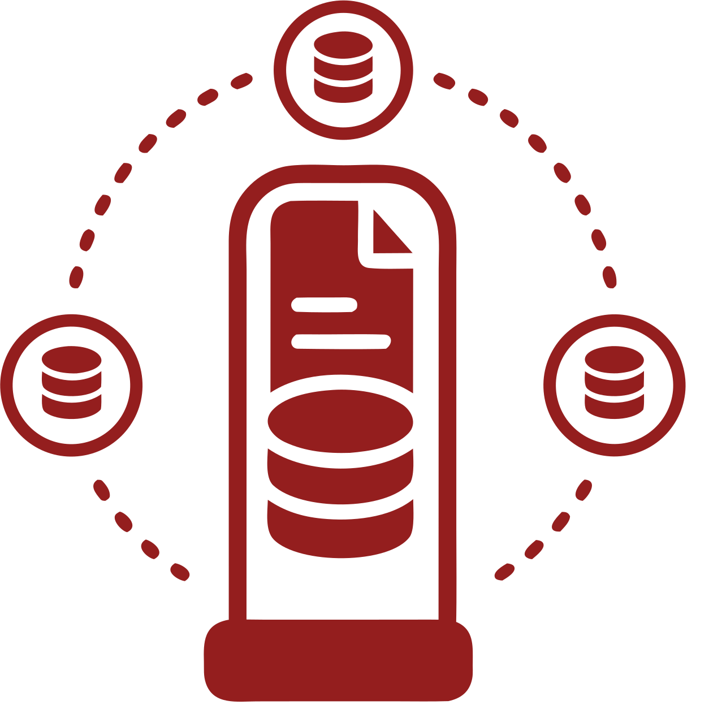
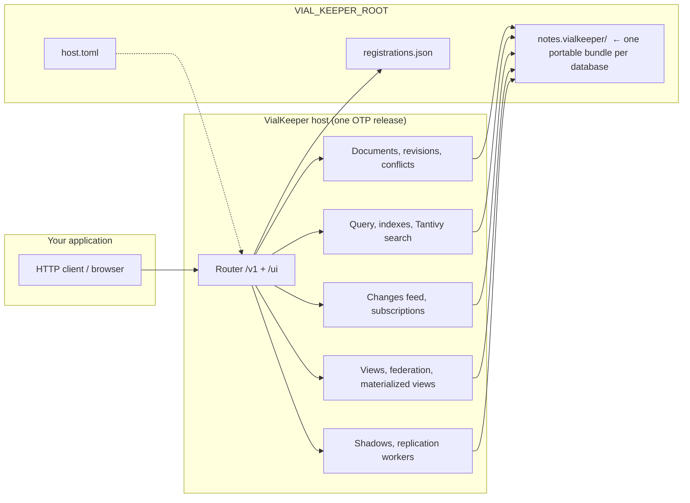
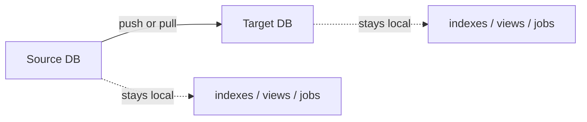
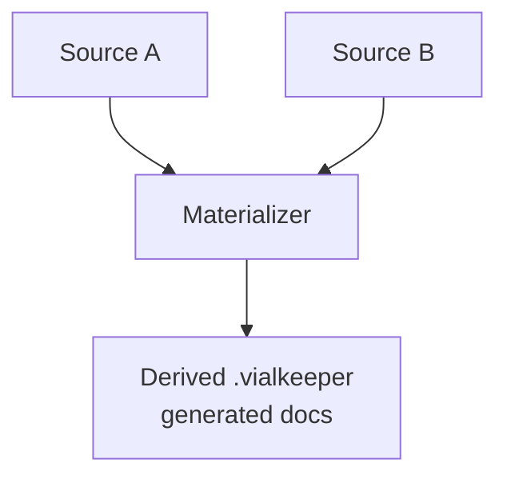

<p align="center">
  
</p>

<h1 align="center">VialKeeper</h1>

<p align="center">
  <strong>A revisioned JSON document database that ships as one Elixir/OTP application.</strong><br />
  Portable <code>.vialkeeper</code> bundles on disk. One versioned HTTP API.
  Live query subscriptions, full-text search, replication, and attachments —
  with no embedded client engine and no glue library.
</p>

<p align="center">
  <a href="#why-vialkeeper">Why</a> ·
  <a href="#capabilities">Capabilities</a> ·
  <a href="#quick-start">Quick start</a> ·
  <a href="#core-concepts">Concepts</a> ·
  <a href="#scale-out">Scale out</a> ·
  <a href="#http-api-map">API map</a> ·
  <a href="#operations">Operations</a> ·
  <a href="#license">License</a>
</p>

<p align="center">
  <a href="LICENSE"></a>
  
  
</p>

---

## TL;DR

- **One process.** Documents, indexes, search, replication, views, and the admin
  console run inside a single OTP application.
- **Your data is a directory.** Each database is a portable `.vialkeeper`
  bundle: close it, `cp -r` it, register it somewhere else.
- **HTTP is the whole contract.** JSON over a versioned `/v1` API with stable
  error codes. No Elixir modules to call, no driver to match your language.
- **Revisions, not last-write-wins.** Every write is an immutable SHA-256
  revision over canonical JSON. Conflicts are preserved and resolved
  explicitly.

## Why VialKeeper

Most document databases make you choose: a rich client library you must
version-match, a wire protocol you must speak exactly, or an embedded engine
that lives inside your process. VialKeeper goes the other way — it is a
**service you operate**, and the service is boring to operate.

| Design choice | What you get |
| ------------- | ------------- |
| **No client SDK** | Any HTTP client works. TypeScript, Go, Rust, Python, `curl`. Unknown JSON fields are rejected, so typos fail loudly instead of silently. |
| **No application schema migrations** | Documents are JSON. Evolve them with your application; the store never needs you to write one. |
| **Portable by construction** | Attachments, indexes, views, and search generations live inside the bundle. Copying a closed bundle is a legitimate backup, move, or handoff. |
| **Live without a queue** | The changes feed and live query subscriptions are built in, so "notify the browser when this document changes" is a stream, not a polling job. |
| **Search that is not the source of truth** | Full-text indexes are a rebuildable sidecar over the authoritative data. Lose the index, rebuild it. |
| **Explicit about durability** | Backups, leases, integrity checks, and clean-host restore drills are documented operations, not folklore. |

## How it fits together


```mermaid
flowchart LR
  subgraph clients["Your application"]
    A["HTTP client / browser"]
  end
  subgraph host["VialKeeper host (one OTP release)"]
    R["Router /v1 + /ui"]
    Q["Query, indexes, Tantivy search"]
    D["Documents, revisions, conflicts"]
    C["Changes feed, subscriptions"]
    V["Views, federation, materialized views"]
    S["Shadows, replication workers"]
  end
  subgraph root["VIAL_KEEPER_ROOT"]
    H["host.toml"]
    G["registrations.json"]
    B["notes.vialkeeper/  ← one portable bundle per database"]
  end
  A --> R
  R --> D & Q & C & V & S
  D & Q & C & V & S --> B
  R --> G
  H -.-> R
```

Each database is one directory:

```text
database root/
  host.toml            # listener, auth, TLS, limits — one editable file
  registrations.json   # routing only: database UUID → relative path
  notes.vialkeeper/    # portable database bundle
    <backend data>     # metadata, revisions, indexes, views, jobs
    blobs/             # attachment representations (digest.blob)
    tmp/               # incomplete uploads and rebuildable search cache
```

**Runtime baseline:** Elixir 1.20.2 on Erlang/OTP 29.0.4 (`mise.toml`,
`mix.lock`). Production hosts run an OTP release; Mix is for development and CI.

## Capabilities

VialKeeper classifies shipped behavior by responsibility. **Core** owns the
authoritative data model and the deliberate scalability/read-model mechanisms.
**Sidecar** functionality is supported but rebuildable from core state.
**Administration** owns deployment, lifecycle, security, maintenance,
diagnostics, and operator interaction.

| Capability | Tier | Notes |
| ---------- | ---- | ----- |
| Documents, revisions and conflicts | Core | Put / get / delete; branches are preserved and resolved explicitly |
| Changes feed | Core | Poll or NDJSON stream from a durable sequence |
| Structured query and indexes | Core | Selector predicates, sort, projection, bookmarks |
| Live subscriptions | Core | NDJSON stream of matching documents |
| Attachments | Core | Upload bytes, reference content-addressed blobs from revisions |
| Replication | Core | One-shot or continuous push/pull between databases |
| Local views | Core | Declarative map/reduce without custom code |
| Federation | Core | Bounded query across several database UUIDs |
| Materialized views | Core | Derived read-only database from several sources |
| Shadows | Core | Generation-fenced read scaling with source fallback |
| Full-text search | Sidecar | Named rebuildable `full_text` indexes backed by TantivyEx |
| Admin console | Administration | Shipped HTMX console at `/ui`; host-configurable at runtime |

### What it does not do

Stating the boundaries up front is cheaper than discovering them later:

- No client engine query language, no raw full-text query syntax, and no
  CouchDB / PouchDB wire compatibility.
- No automatic adoption of bundles dropped under the root — you register them.
- No multi-database transactions and no live federation streams.
- No custom JavaScript/Elixir map functions inside views.
- No cloning by copy: a copied bundle keeps the same UUID, so two copies on one
  host are rejected.
- No in-place format migration and no format-compatibility promise. V1 rejects
  other formats (`unsupported_format`); rollback is the previous release
  against a pre-upgrade closed-bundle backup.
- It is not an embeddable Mix dependency. Elixir modules are internal
  implementation boundaries, not a supported embedding API.

**Status:** `v0.1.0`, pre-1.0. The HTTP surface is versioned under `/v1`; the
on-disk format is not. Read [Operations.md](Operations.md) before you put real
data in front of users.

---

## Quick start

### Run a host

Production and staging run an assembled OTP release:

```sh
# Pinned toolchain from mise.toml (Elixir 1.20.2 / OTP 29.0.4); a Rust
# toolchain is required because the Tantivy and SQLite NIFs compile at build time.
MIX_ENV=prod mix release.build

export VIAL_KEEPER_ROOT=/var/lib/vialkeeper
bin/vial_keeper daemon                # or `bin/vial_keeper start` in the foreground
```

The first start in an empty root creates the directory and a fully commented
`host.toml`; an existing `host.toml` is never overwritten. The default listener
is **loopback only** at `127.0.0.1:4000` with auth off. Binding a remote
address requires auth and/or TLS. Full deployment, systemd, auth, and TLS
procedures: [Operations.md](Operations.md).

### Create a database

```sh
curl -sS http://127.0.0.1:4000/v1/databases \
  -H 'content-type: application/json' \
  -d '{"path":"notes.vialkeeper"}'
```

### Use it from TypeScript

When `[auth] enabled = true` in `host.toml`, send the raw token printed by
`bin/vial_keeper token`.

```typescript
const baseUrl = "http://127.0.0.1:4000";
const bearerToken = process.env.VIALKEEPER_TOKEN; // only if auth is enabled

type Envelope<T> = {
  request_id: string;
  data?: T;
  error?: { code: string; message: string; retryable: boolean };
};

async function postJson<T>(
  path: string,
  body: unknown,
): Promise<{ status: number; envelope: Envelope<T> }> {
  const headers: Record<string, string> = {
    accept: "application/json",
    "content-type": "application/json",
  };
  if (bearerToken) headers.authorization = `Bearer ${bearerToken}`;

  const response = await fetch(`${baseUrl}${path}`, {
    method: "POST",
    headers,
    body: JSON.stringify(body),
  });
  return { status: response.status, envelope: (await response.json()) as Envelope<T> };
}

const created = await postJson<{ database_uuid: string }>("/v1/databases", {
  path: "notes.vialkeeper",
});
if (created.status !== 201 || !created.envelope.data) {
    throw new Error(created.envelope.error?.message ?? "creation failed");
}
const uuid = created.envelope.data.database_uuid;

const put = await postJson<{ revision: string }>(
  `/v1/databases/${uuid}/documents/put`,
  { id: "note-1", body: { title: "Hello", done: false } },
);
const revision = put.envelope.data!.revision;

const got = await postJson<{ body: { title: string }; revision: string }>(
  `/v1/databases/${uuid}/documents/get`,
  { id: "note-1" },
);
console.log(got.envelope.data?.body.title, got.envelope.data?.revision === revision);

await postJson(`/v1/databases/${uuid}/close`, {});
```

Successful responses are `{"request_id","data"}`; failures are
`{"request_id","error":{"code","message","retryable",…}}`. Document IDs live in
the JSON body, not the URL path. Databases live under `VIAL_KEEPER_ROOT`
(default `./data`), and create/register paths are **relative** to that root.

Prefer to read instead of run? There is a
[visual introduction](docs/vialkeeper-introduction.html) and a replication
[scenario harness](demo/replication_harness/README.md) in this repository.

---

## Core concepts

### Documents and revisions

Every write creates an immutable SHA-256 revision over canonical JSON.

```text
put without if_revision     → new document (or new conflict branch)
put with if_revision        → conditional update (CAS)
delete with if_revision     → tombstone
resolve                     → pick a winner among live conflict leaves
```

```typescript
await postJson(`/v1/databases/${uuid}/documents/put`, {
  id: "note-1",
  if_revision: revision,
  body: { title: "Hello", done: true },
});

await postJson(`/v1/databases/${uuid}/documents/delete`, {
  id: "note-1",
  if_revision: revision,
});

// Conflict resolution when several leaves are live
await postJson(`/v1/databases/${uuid}/documents/resolve`, {
  id: "note-1",
  expected_live_revisions: [revA, revB],
  chosen_parent_revision: revA,
  body: { title: "Merged" },
});
```

Bulk helpers: `POST …/documents/bulk-get` and `…/documents/bulk-write`
(JSON arrays).

### Queries and indexes

Selectors are storage-neutral. Supported field operators include `$eq`, `$ne`,
`$gt` / `$gte` / `$lt` / `$lte`, `$in` / `$nin`, `$exists`, `$type`,
`$beginsWith`, bounded `$regex`, `$all`, `$elemMatch`, `$size`, `$mod`, plus
`$and` / `$or` / `$nor` / `$not`. A bare JSON value at a path means equality.

```typescript
const query = await postJson<{
  plan_kind: string;
  documents: unknown[];
  results: unknown[];
  bookmark?: string;
}>(`/v1/databases/${uuid}/query`, {
  selector: {
    $or: [{ "/status": "open" }, { "/priority": { $gte: 5 } }],
    "/title": { $beginsWith: "rep" },
  },
  fields: ["/title", "/status"],
  sort: [{ path: "/priority", direction: "desc" }],
  limit: 20,
});

// Same rows appear as both `documents` and `results`.
console.log(query.envelope.data?.plan_kind, query.envelope.data?.documents);

const next = await postJson(`/v1/databases/${uuid}/query`, {
  selector: { "/status": "open" },
  limit: 20,
  bookmark: query.envelope.data?.bookmark,
});
```

Bookmarks are opaque. Send them unchanged. If the plan or database sequence
changed, you get `bookmark_stale` (retryable) — start over.

Explain a plan:

```typescript
await postJson(`/v1/databases/${uuid}/query/explain`, {
  selector: { "/title": { $regex: "^rep" } },
});
```

Indexes are named and rebuildable:

```typescript
await postJson(`/v1/databases/${uuid}/indexes`, {
  name: "by_status",
  type: "structured",
  fields: [
    { path: "/status", type: "string", direction: "asc" },
    { path: "/priority", type: "number", direction: "asc" },
  ],
});
```

List / delete / rebuild: `GET …/indexes`, `DELETE …/indexes/:index_id`,
`POST …/indexes/:index_id/rebuild`. Structured fields are `{path, type,
direction}` objects. Full-text fields are JSON Pointers.

### Full-text search

Create a named `full_text` index over JSON Pointers into the document body.
`search.index` is that **name**. Tantivy's built-in default analyzer owns
tokenization, Unicode handling, phrase positions, prefix expansion, and
BM25-style ranking. `search.text` is ordinary text — not an engine query
language; punctuation is not syntax.

Matching uses Tantivy's native inverted index, not a SQLite FTS table or an
Elixir tokenization layer. A rebuild writes a fresh generation under the bundle
`tmp/search/indexes/` directory and publishes it only after commit; the previous
generation remains searchable while the rebuild is in progress. Winner changes
are applied as bounded Tantivy writer updates and published without fsync
(cache-level durability); the index is rebuildable from SQLite. Rebuild
completion performs a durable commit with explicit sync.

```typescript
await postJson(`/v1/databases/${uuid}/indexes`, {
  name: "body_fts",
  type: "full_text",
  fields: ["/title", "/body"],
});
```

| Mode | A document matches when |
| ---- | ----------------------- |
| `all` | every query token is a complete indexed token (default) |
| `any` | at least one query token is a complete indexed token |
| `phrase` | query tokens appear in order as consecutive indexed tokens |
| `prefix` | every query token is a prefix of some indexed token, not an infix |

`all`, `any`, and `phrase` need finished words. Combine `search` with a
`selector` for structured filters. Project list fields with `fields`; open a
hit with `documents/get`. The page includes `examined` (candidates considered)
and `documents` (the limited hits); the same rows also appear as `results`.
Indexes stay on the database that created them; they do not replicate. Live
query subscriptions cannot include `search`.

```typescript
const page = await postJson<{
  documents: Array<{ id: string; fields?: Record<string, unknown> }>;
  examined: number;
}>(`/v1/databases/${uuid}/query`, {
  selector: { "/status": "open" },
  search: { index: "body_fts", text: "hello world", mode: "phrase" },
  fields: ["/title", "/body"],
  limit: 20,
});
```

#### Search as you type

Typeahead is a client recipe on the same `/query` contract. The server does not
debounce. While the user is typing, send `mode: "prefix"` with a small `limit`
(about 10). Wait until at least one token has three characters, and drop a
trailing token shorter than three — that word is still being typed. Debounce
about 200 ms and abort the in-flight request when a newer keystroke is ready.
`examined` much larger than `documents.length` means the prefix is still too
broad.

When the user commits a finished phrase, switch to `all` or `phrase` and a
larger limit (25–50). If list snippets must contain the hit, store smaller
documents (for example one paragraph per document) and project that field.
Clients skip empty prefix queries and ignore stale responses the same way the
example aborts an in-flight HTTP request.

```typescript
const minToken = 3;
const debounceMs = 200;
const typeaheadLimit = 10;

function prefixQuery(input: string): string | null {
  const tokens = Array.from(input.toLowerCase().matchAll(/[\p{L}\p{N}]+/gu), (m) => m[0]);
  const last = tokens.at(-1);
  const ready = last && last.length >= minToken ? tokens : tokens.slice(0, -1);
  const kept = ready.filter((token) => token.length >= minToken);
  return kept.length === 0 ? null : kept.join(" ");
}

let debounceTimer = 0;
let inFlight: AbortController | undefined;

function onSearchInput(input: string) {
  window.clearTimeout(debounceTimer);
  inFlight?.abort();
  debounceTimer = window.setTimeout(() => {
    void runTypeahead(input);
  }, debounceMs);
}

async function runTypeahead(input: string) {
  const text = prefixQuery(input);
  if (!text) return [];

  inFlight = new AbortController();
  const headers: Record<string, string> = {
    accept: "application/json",
    "content-type": "application/json",
  };
  if (bearerToken) headers.authorization = `Bearer ${bearerToken}`;

  const response = await fetch(`${baseUrl}/v1/databases/${uuid}/query`, {
    method: "POST",
    headers,
    signal: inFlight.signal,
    body: JSON.stringify({
      search: { index: "body_fts", text, mode: "prefix" },
      fields: ["/title", "/body"],
      limit: typeaheadLimit,
    }),
  });
  const envelope = (await response.json()) as Envelope<{
    documents: Array<{ id: string; fields?: Record<string, unknown> }>;
    examined: number;
  }>;
  if (!response.ok || envelope.error) {
    throw new Error(envelope.error?.message ?? "search failed");
  }
  return envelope.data?.documents ?? [];
}

// After the user commits a finished query:
await postJson(`/v1/databases/${uuid}/query`, {
  search: { index: "body_fts", text: "hello world", mode: "phrase" },
  fields: ["/title", "/body"],
  limit: 50,
});
```

### Changes feed

```typescript
const changes = await postJson<{
  results: unknown[];
  last_sequence: number;
  has_more?: boolean;
}>(`/v1/databases/${uuid}/changes`, {
  since: 0,
  limit: 100,
  wait_ms: 0, // set > 0 to long-poll
});

// NDJSON stream: change | caught_up | heartbeat | closed | error
const stream = await fetch(`${baseUrl}/v1/databases/${uuid}/changes/stream`, {
  method: "POST",
  headers: { "content-type": "application/json", accept: "application/x-ndjson" },
  body: JSON.stringify({ since: 0, limit: 100, heartbeat_ms: 15000 }),
});
```

### Attachments

1. Upload raw bytes → get a content-addressed `blob` digest.
2. Reference that digest in a document put.
3. Download by document id + attachment name.

Storage encoding is transparent: ingest picks raw or Zstandard per blob and
stores one `digest.blob` file (payload + integrity trailer); downloads always
return the original bytes.

```typescript
const upload = await fetch(`${baseUrl}/v1/databases/${uuid}/attachments/upload`, {
  method: "POST",
  headers: {
    "content-type": "application/octet-stream",
    ...(bearerToken ? { authorization: `Bearer ${bearerToken}` } : {}),
  },
  body: bytes,
});
const { data: blob } = (await upload.json()) as {
  data: { blob: string; length: number; expires_at: string };
};

await postJson(`/v1/databases/${uuid}/documents/put`, {
  id: "note-1",
  body: { title: "Hello" },
  attachments: {
    "source.txt": { blob: blob.blob, content_type: "text/plain" },
  },
});

const download = await fetch(`${baseUrl}/v1/databases/${uuid}/attachments/get`, {
  method: "POST",
  headers: { "content-type": "application/json" },
  body: JSON.stringify({ id: "note-1", revision: null, name: "source.txt" }),
});
```

Attachment names are metadata, not filesystem paths.

### Live query subscriptions

```text
POST /v1/databases/:uuid/query/stream   → application/x-ndjson
```

The request accepts only `query.selector`, optional `query.fields`, and
`heartbeat_ms`. **Not allowed:** `sort`, `limit`, `bookmark`, `index`, `search`.

```typescript
const res = await fetch(`${baseUrl}/v1/databases/${uuid}/query/stream`, {
  method: "POST",
  headers: { "content-type": "application/json", accept: "application/x-ndjson" },
  body: JSON.stringify({
    query: {
      selector: { "/type": "task", "/status": "open" },
      fields: ["/title", "/status"],
    },
    heartbeat_ms: 15000,
  }),
});
```

| Event | Meaning |
| ----- | ------- |
| `snapshot` | Initial matching document |
| `caught_up` | Snapshot finished |
| `upsert` | Document entered or changed while matching |
| `remove` | Document left the set or was deleted |
| `reset` | History gap — clear local membership, then expect a new snapshot |
| `heartbeat` | Keepalive |
| `closed` | Database closed |
| `error` | e.g. `subscription_overloaded` (retryable) |

Subscription state is **not** stored in the database. After a reopen, clients
must subscribe again.

### Local declarative views

Views are per-database derived state. They do **not** replicate. Definitions use
path/literal expressions and fixed reducers only (`_count`, `_sum`, `_min`,
`_max`, `_stats`).

```typescript
const view = await postJson<{ view_id: string }>(`/v1/databases/${uuid}/views`, {
  name: "scores",
  selector: { "/kind": "task" },
  key: [{ path: "/kind" }],
  value: { path: "/score" },
  reducer: "_sum",
});

await postJson(`/v1/databases/${uuid}/views/${view.envelope.data!.view_id}/query`, {
  consistency: "stale_ok", // or "update_after" | "consistent"
  limit: 50,
});
```

Other routes: `GET …/views`, `DELETE …/views/:view_id`,
`POST …/views/:view_id/rebuild`.

---

## Scale out

### Replication

Replication moves complete revision chains, tombstones, and attachment bytes.
It keeps revision IDs and deterministic winners. Indexes, local views, and job
definitions stay local to each database.


```mermaid
flowchart LR
  A["Source DB"] -->|push or pull| B["Target DB"]
  A -.->|"stays local"| IA["indexes / views / jobs"]
  B -.->|"stays local"| IB["indexes / views / jobs"]
```

```typescript
await postJson(`/v1/databases/${uuid}/replications`, {
  mode: "continuous", // or "one_shot"
  direction: "push",  // or "pull"
  enabled: true,
  endpoint: {
    kind: "remote",
    database_uuid: targetUuid,
    base_url: "https://other-host:4000",
    auth_token: "raw-bearer-if-target-auth-enabled",
  },
});

// Local endpoint: { kind: "local", database_uuid: "…" }
```

Control: `GET …/replications`, `…/:job_id`, `…/start`, `…/cancel`,
`…/enable`, `…/disable`, `DELETE …/:job_id`. Continuous enabled jobs resume
after a restart. One-shot jobs end in `completed` or `failed`.

The remote peer wire (`/v1/databases/:uuid/replication/…`) sends
Zstandard-compressed JSON (`Content-Encoding: zstd`,
`x-vialkeeper-uncompressed-length`). Public document and job APIs stay
uncompressed JSON even when a client sends `Accept-Encoding: zstd`. Attachment
payloads transfer as the stored representation byte for byte — raw or
Zstandard as chosen at ingest — using
`application/vnd.vialkeeper.blob-representation` without HTTP
`Content-Encoding`, and the target installs them without probing or re-encoding.

Operator details (job states, transfer limits, peer auth):
[Operations.md](Operations.md).

### Shadow databases

A shadow is a generation-fenced, read-only materialization of one ordinary
source database. The source stores the desired shadow definition and reports
redacted desired/observed state; enabling or changing a definition is
asynchronous and returns `202`.

```typescript
await putJson(`/v1/databases/${sourceUuid}/shadow`, {
  enabled: true,
  location: "worker-a",
  attachment_location: "/srv/vialkeeper/cas",
});

const status = await getJson(`/v1/databases/${sourceUuid}/shadow`);
```

The source API accepts only ordinary source databases. Generations and
operation IDs fence replacement and cleanup, and status never exposes bearer
tokens or managed storage paths. Public shadow reads are admitted only after the
worker reports the exact generation ready; the worker control plane is
authenticated separately from the ordinary public API and uses the bounded
Zstandard JSON wire.

Once a generation is ready, eligible point, bulk, and attachment reads default
to eventual routing only while the public source is an ordinary open database.
Send `x-vialkeeper-read-consistency: primary` to bypass the shadow explicitly.
Reads are served by the exact generation snapshot when possible. A lagging
document, revision, or attachment miss falls back to the source for that
request and keeps the route. Transport, protocol, identity, or store failure
falls back once, retires only that exact snapshot, notifies reconciliation, and
reports `x-vialkeeper-read-served-by: source`. Shadow-served responses report
`shadow` plus the durable `x-vialkeeper-source-watermark`. Attachment
downloads use the same consistency choice and stream from the configured
external CAS without copying attachment bytes into the shadow bundle. A closed
or unregistered source is never served from a shadow.

Operator configuration and the worker lifecycle are documented in
[Operations.md](Operations.md#shadow-control-and-workers).

### Cross-database federation

Query several **distinct ordinary** database UUIDs in one request. No writes,
joins, full-text search, index hints, or live federation.

```typescript
const page = await postJson<{
  documents: Array<{ id: string; source_database_uuid: string; fields: object }>;
  sources: Array<{ database_uuid: string; sequence: number }>;
  bookmark?: string;
}>("/v1/federation/query", {
  databases: [uuidA, uuidB],
  query: {
    selector: { "/kind": "task" },
    fields: ["/value"],
    sort: [{ path: "/value", direction: "asc" }],
    limit: 50,
  },
});
```

There is no atomic snapshot across databases. The response lists the
`{database_uuid, sequence}` vector used. Continuing with a bookmark after a
source advanced returns `bookmark_stale`.

Named saved queries live in `host.toml` (`[[federation.saved_query]]`). List /
run: `GET /v1/federation/saved-queries`,
`POST /v1/federation/saved-queries/execute` with `{ name, limit?, bookmark? }`.

### Materialized federated views

A materialized view is a **derived** `.vialkeeper` bundle. Generated documents
are externally read-only (`derived_database_read_only`). You can still query,
index, add local views, and use it as a replication **source**.


```mermaid
flowchart TB
  S1[Source A] --> M[Materializer]
  S2[Source B] --> M
  M --> D["Derived .vialkeeper<br/>generated docs"]
```

```typescript
const mv = await postJson<{ database_uuid: string; database_kind: string }>(
  "/v1/materialized-views",
  {
    name: "Sales",
    sources: [sourceUuid],
    map: {
      key: [{ path: "/kind" }],
      value: { path: "/amount" },
    },
    reduce: "_sum",
    enabled: true,
  },
);

const derived = mv.envelope.data!.database_uuid;
await postJson(`/v1/materialized-views/${derived}/refresh`, {});
await postJson(`/v1/materialized-views/${derived}/rebuild`, {});
await postJson(`/v1/materialized-views/${derived}/disable`, {});
```

Disable materialization before closing a source or the derived database.
Bundles are usually created under `_derived/…derived.vialkeeper` (the path is a
hint; `database_kind = derived` in metadata is authoritative).

---

## Offline portability

1. Stop writers and continuous jobs that need the database open.
2. `POST /v1/databases/:uuid/close`.
3. Copy the whole `.vialkeeper` directory with normal OS tools.
4. On the destination: place the bundle, then `POST /v1/registrations`
   with `{ "path": "notes.vialkeeper" }`.

Do not treat `.lease` as data. Copying keeps the same UUID — two copies on one
host are rejected. A replica is not a backup: logical deletes replicate. Full
procedures: [Operations.md](Operations.md#offline-copy-move-and-restore).

## Errors and limits

Public errors use stable codes (`revision_conflict`, `database_overloaded`,
`bookmark_stale`, …). Backend exception names and engine diagnostics are **not**
part of the contract. Drive retry policy from `error.retryable`.

Host ceilings live in the `host.toml` `[limits]` section. Per-database config
(`GET`/`PUT /v1/databases/:uuid/config`) can only be **more** restrictive.
Common caps: document size, query results, changes batch, attachment size,
subscription membership, view counts, and full-text rebuild duration
(`max_search_rebuild_ms`). Open disk databases serve classified reads from a
bounded snapshot pool (`read_pool_size` / `read_queue_limit`); writes stay on
one owner connection.

When a limit is hit you typically see `resource_limit`, `payload_too_large`,
`database_overloaded`, `subscription_overloaded`, or `attachment_overloaded`.

## HTTP API map

| Area | Paths |
| ---- | ----- |
| Databases | `POST/GET /v1/databases`, `GET …/:uuid`, `…/config`, `…/close` |
| Registration | `POST /v1/registrations`, `DELETE /v1/registrations/:uuid` |
| Documents | `…/documents/{get,put,delete,resolve,bulk-get,bulk-write}` |
| Changes | `…/changes`, `…/changes/stream` |
| Query | `…/query`, `…/query/explain`, `…/query/stream` |
| Indexes | `…/indexes`, `…/indexes/:id`, `…/indexes/:id/rebuild` |
| Attachments | `…/attachments/upload`, `…/attachments/get` |
| Views | `…/views`, `…/views/:id/{rebuild,query}` |
| Replications | `…/replications` (+ start/cancel/enable/disable) |
| Shadows | `…/shadow` (desired state and redacted status) |
| Shadow control | `/v1/control-plane/capabilities`, generation provision/inspect/destroy/read routes |
| Federation | `/v1/federation/query`, `/v1/federation/saved-queries` |
| Materialized | `/v1/materialized-views` (+ refresh/rebuild/enable/disable) |
| Maintenance | `…/integrity-check`, `…/compact` |
| UI | `/ui` (when `[web_ui] enabled = true`) |

---

## Operations

The operator runbook covers build, start/stop, `host.toml`, authentication,
TLS, the database root, offline copy/move/restore, backup manifests, integrity
and compaction, replication jobs, shadow workers, observability, and a
go-live checklist:

- **[Operations.md](Operations.md)** — deployment and operator procedures
- **[lib/vial_keeper/storage/sqlite/BACKEND.md](lib/vial_keeper/storage/sqlite/BACKEND.md)** — backend layout and controls
- **[bench/README.md](bench/README.md)** — dataset-backed FTS, stress, and torture benchmarks
- **[docs/vialkeeper-introduction.html](docs/vialkeeper-introduction.html)** — visual introduction
- **[demo/replication_harness/README.md](demo/replication_harness/README.md)** — replication scenario harness

The assembled release reports its runtime and selected-backend identity through
an operator-only diagnostic command. That diagnostic does not define a client
integration surface.

## Contributing

Bug reports and feature requests are welcome through GitHub issues. Small
pull requests with `mix check.fast` green are the fastest to land. The
development loop is:

```sh
mix deps.get
mix check.fast          # while iterating (excludes :slow and :integration)
mix check.integration   # integration-tagged tests only
mix check.full          # before handoff (integration, :slow, Doctor, Reach dead-code; needs Docker or Podman)
MIX_ENV=prod mix release.build
```

When you change storage, runtime, domain, or product-model code, also run the
repository boundary scan:

```sh
mix storage.boundary_check
```

`mix check.full` includes the storage-boundary scan and the MAINT-007
clean-host restore drill (`test/end_to_end/clean_host_restore_drill_test.exs`).
That drill requires a working **Docker or Podman** daemon (`docker info` /
`podman info`); the restore host is a glibc container with only the OTP release
and a bind-mounted destination `VIAL_KEEPER_ROOT`.

Please report security issues privately rather than in a public issue — see
[SECURITY.md](SECURITY.md).

## License

Released under the [MIT License](LICENSE).
